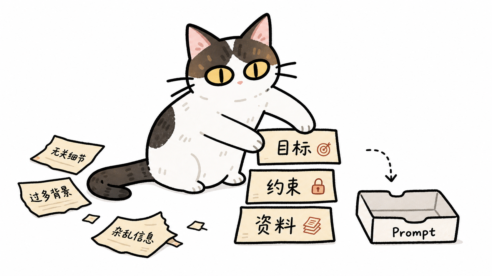
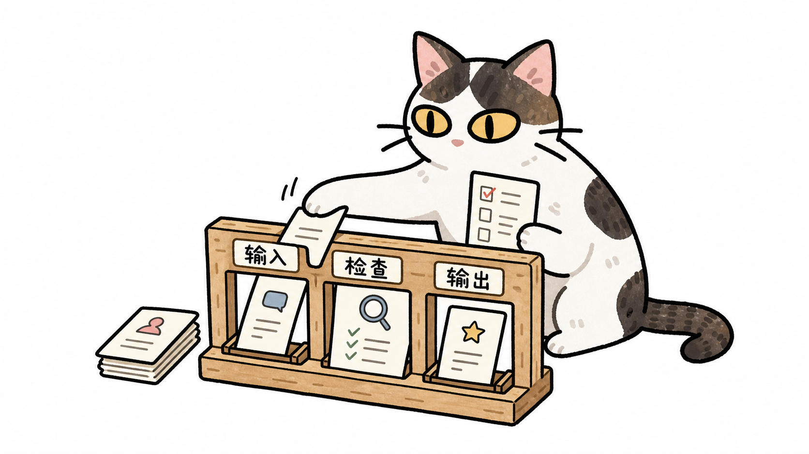
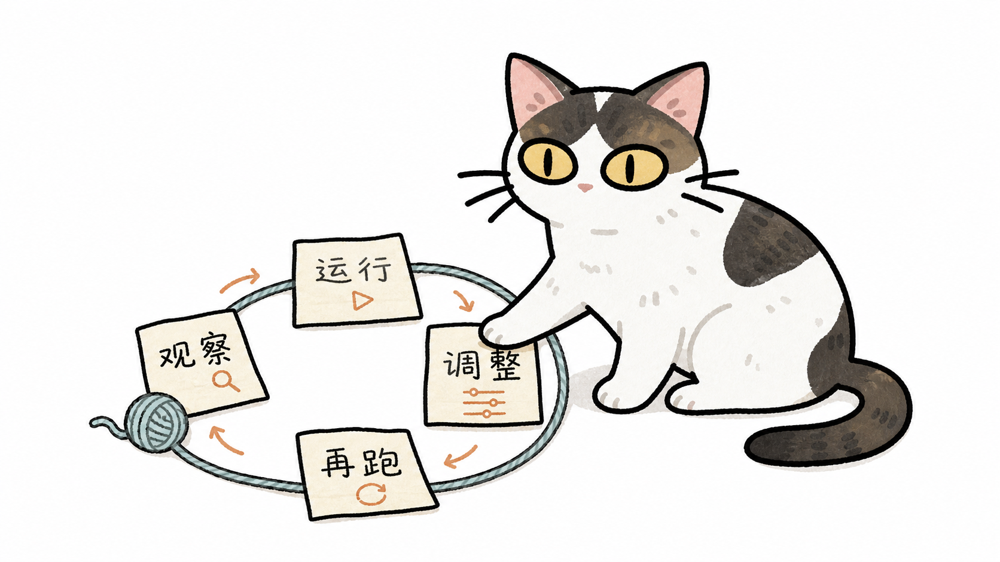

# Cat Note Illustrations

> 把中文文章、飞书笔记里的判断、流程、状态和隐喻，变成一张张白底、手账便签风、猫猫参与核心动作的正文配图。
>
> 16:9 横版 | Specimen 0 猫猫 IP | 手账贴纸风 | 黄眼竖瞳 | Codex Skill

---

## 这个仓库是什么

Cat Note Illustrations 是一个 Codex Skill，用来指导 AI Agent 为中文文章、飞书笔记、博客和知识型内容生成正文配图。

它不是通用插画 prompt，也不是 PPT 信息图模板。它的核心目标是：先理解文章里的认知锚点，再把其中一个判断、流程、结构、状态或隐喻，变成一张有记忆点的 16:9 猫猫正文配图。

默认视觉 IP 是 **Specimen 0**：一只米白身体、深色头顶/后背/尾巴斑块、明黄色大眼、黑色细竖瞳的双色短毛猫。它的气质是“清空大脑但看透一切”的呆滞幽默感。

一句话：**让 AI 不只是“配一张图”，而是让一只固定猫猫把文章里的关键认知动作演出来。**

---

## 来源与风格修改

这个项目参考来自 [helloianneo/ian-xiaohei-illustrations](https://github.com/helloianneo/ian-xiaohei-illustrations)。

我很喜欢原项目“先理解正文，再把文章里的关键判断画成正文配图”的工作流，所以保留了这套思路：

- Codex Skill 的使用方式
- 先理解正文，再生成 shot list 的工作流
- 一张图只表达一个核心认知动作的原则
- 16:9 横版正文配图的交付方式
- 防止图像变成 PPT 信息图、课程页或复杂解释图的 QA 思路

这个版本主要做了风格修改：

- 默认视觉 IP 从“小黑”改为 **Specimen 0 猫猫**
- 风格从“白底手绘怪诞产品草图感”改为“手账便签贴纸风 + 现代简约漫画感”
- 强化猫猫角色一致性：双色斑块、黄色大眼、黑色细竖瞳、呆滞幽默感
- 重写 `style-dna.md`、`cat-ip.md`、`prompt-template.md`、`qa-checklist.md`
- 移除了原项目示例图片，避免小黑风格误导猫猫版本

详细来源见 [NOTICE.md](NOTICE.md) 和 [cat-note-illustrations/ATTRIBUTION.md](cat-note-illustrations/ATTRIBUTION.md)。

---

## 适合谁用

特别适合：

- 写中文文章、飞书笔记，需要正文配图的人
- 做知识型内容、方法论内容、AI 工作流内容的人
- 想把抽象判断画成具体隐喻的人
- 想要一种比 PPT 信息图更轻、更有个人识别度的猫猫视觉语言的人
- 用 Codex 做内容生产，希望稳定复用一套插图风格的人

不适合：

- 想要商业 KV、品牌海报或精致矢量插画的人
- 想要传统 PPT 信息图、复杂架构图或流程图的人
- 需要严格可编辑矢量源文件的人
- 想把大量正文、长段解释或完整课程页塞进一张图里的人

---

## 它会产出什么

默认输出：

- 16:9 横版正文配图
- 一篇文章的 4-8 张 shot list
- 每张图的主题、核心意思、结构类型、猫猫动作和中文标注建议
- 最终 PNG 图片，保存到 workspace 的 `assets/<article-slug>-illustrations/`

默认不输出：

- PPTX / PDF / Keynote
- SVG / HTML / Canvas 可编辑图
- 商业海报或封面 KV
- 大段文字型信息图

---

## 视觉风格

这个 Skill 默认使用 Specimen 0 猫猫正文配图风格：

- 纯白或近白背景
- 中等偏粗、不完全均匀的黑色手绘墨线
- 手账便签贴纸感，线条闭合，轮廓像剪纸贴纸
- 低饱和暖色平涂，可带极淡纸感/色铅笔颗粒
- 默认主角是米白身体、深色头顶/后背/尾巴斑块的双色猫
- 眼睛必须是明黄色大眼 + 黑色细竖瞳
- 表情有“清空大脑但看透一切”的呆滞幽默感
- 一张图只表达一个核心动作、结构、状态或隐喻
- 猫猫必须参与核心动作，不能只是装饰

---

## 安装

克隆仓库：

```bash
git clone https://github.com/Andrew-JX/cat-note-illustrations.git
cd cat-note-illustrations
```

复制 Skill 到 Codex skills 目录：

```bash
mkdir -p "${CODEX_HOME:-$HOME/.codex}/skills"
cp -R ./cat-note-illustrations "${CODEX_HOME:-$HOME/.codex}/skills/"
```

Windows PowerShell：

```powershell
$skillRoot = Join-Path $env:USERPROFILE ".codex\skills"
New-Item -ItemType Directory -Force -Path $skillRoot | Out-Null
Copy-Item -Recurse .\cat-note-illustrations $skillRoot
```

安装后，在 Codex 里使用：

```text
Use $cat-note-illustrations 为这篇中文文章设计并生成几张正文配图。
```

---

## 怎么用

### 为单个概念生成一张图

```text
Use $cat-note-illustrations 为“AI 不是替你思考，而是帮你把思考摊开检查”生成一张正文配图。
```

### 只做配图规划

```text
Use $cat-note-illustrations 先不要生成图片。
请分析下面这篇飞书笔记哪里值得配图，输出 5 张左右的 shot list。
每张图写清楚：放在哪段后、主题、核心意思、结构类型、猫猫在做什么、建议中文标注词。

<粘贴正文>
```

### 按规划生成图片

```text
Use $cat-note-illustrations 按上面的 shot list 生成正文配图。
```

### 编辑图片

```text
Use $cat-note-illustrations 帮我编辑这张图，去掉左上角多余标题，其他内容保持不变。
```

更多示例见 [examples/prompts.md](examples/prompts.md)。

---

## 示例图

### Context Engineering

```text
Use $cat-note-illustrations 为“context engineering：不是把所有东西塞进 prompt，而是选择正确的目标、约束和资料”生成一张正文配图。
```



### Harness Engineering

```text
Use $cat-note-illustrations 为“harness engineering：用输入、检查和输出反复测试 AI 行为”生成一张正文配图。
```



### Loop Engineering

```text
Use $cat-note-illustrations 为“loop engineering：通过运行、观察、调整、再跑来改进 AI 工作流”生成一张正文配图。
```



---

## 工作流程

这个 Skill 的流程是：

1. 读取文章、飞书笔记、Markdown、截图或用户给的主题
2. 提炼核心观点、认知转折、流程结构和适合视觉化的段落
3. 先输出 shot list：每张图只选一个认知锚点
4. 为每张图选择结构类型：Workflow、系统局部、前后对比、角色状态、概念隐喻、方法分层、地图路线或小漫画分镜
5. 重新发明一个低科技、成立且容易读懂的视觉隐喻
6. 让 Specimen 0 猫猫承担核心动作
7. 每张图单独调用图像模型生成
8. 按 QA checklist 检查：白底、黄眼竖瞳、双色斑块、猫猫动作、非 PPT 感、非泛猫
9. 保存最终 PNG，并报告用途和路径

---

## 目录结构

```text
.
├── README.md
├── LICENSE
├── NOTICE.md
├── examples/
│   ├── images/
│   └── prompts.md
└── cat-note-illustrations/
    ├── SKILL.md
    ├── agents/
    │   └── openai.yaml
    └── references/
        ├── style-dna.md
        ├── cat-ip.md
        ├── composition-patterns.md
        ├── prompt-template.md
        └── qa-checklist.md
```

真正需要安装到 Codex 的是子目录：

```text
cat-note-illustrations/
```

根目录的 README、LICENSE、NOTICE 和 examples 是 GitHub 分享文档。

---

## 注意事项

- 图片里的中文文字越短越稳定。
- 每张图只讲一个核心结构，不要把文章做成说明书。
- Specimen 0 必须承担核心动作；如果去掉猫猫画面仍然完全成立，说明猫猫太装饰了。
- 默认不要随机换猫型。普通任务应保持米白身体、深色斑块、黄色竖瞳的固定角色。
- 尾巴必须从身体后侧自然长出，不能断开、漂浮、分成两段或变成独立箭头。
- AI 图像模型可能出现错字、幻觉标签、风格漂移或多余标题，生成后需要检查。
- 如果中文错字严重，优先减少标注词并重生成。

---

## License

MIT License. See [LICENSE](LICENSE).
